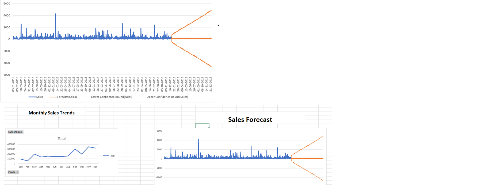

# retail-sales-time-series-analysis-excel
Time series analysis and sales forecasting using Excel
# Retail Sales Time Series Analysis & Forecast

## Objective
Analyze retail sales data over time and build a forecast model to predict future trends.

## Tools Used
- Microsoft Excel
- Pivot Tables
- Time Series Analysis
- Forecasting Model

## Process
- Cleaned and structured raw sales data
- Extracted time-based features (Month, Year)
- Created monthly and yearly sales analysis
- Built a forecast model using Excel

## Key Insights
- Sales show fluctuations over time with no consistent linear growth
- Certain periods show spikes in sales, indicating irregular demand
- Forecast shows increasing uncertainty due to variability in data

## Files Included

## Dashboard Preview

- Excel analysis file
- Dataset
- Dashboard screenshots
